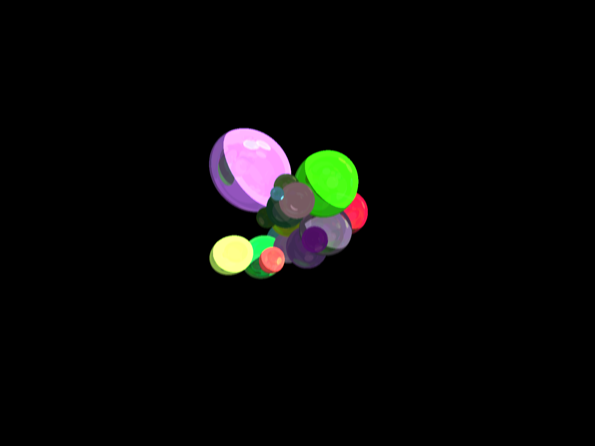

# rays
Raytracer experimentation (starting C++, may do Rust). The code is definitely very much still a work in progress, since it's:

- *extremely* slow: at minimum, you'd wanna multithread this or do it in OpenGL compute shaders
- barebones: no depth of field, no alias fixing, no non-sphere shapes, no ground

That being said, the conceptual leaps to go from this point to including these features is far smaller than that from nothing to here. To run:

## Windows
Run:
```
mkdir build
cmake -DVCPKG_TARGET_TRIPLET=x64-windows-static -DCMAKE_TOOLCHAIN_FILE="C:/Users/ypatel/Documents/vcpkg/scripts/buildsystems/vcpkg.cmake" ..
```

Build with VS studio (or gcc/clang if using Linux/Mac) and run:

```
.\raytrace.exe --width 1600 --height 1200 --balls 25 --rays 3
```

Should give something (after ~5 min) similar to:

